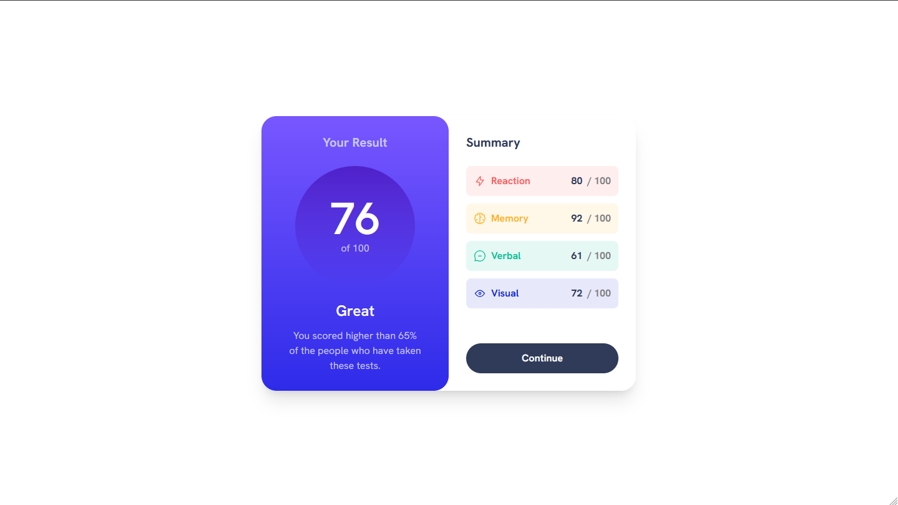
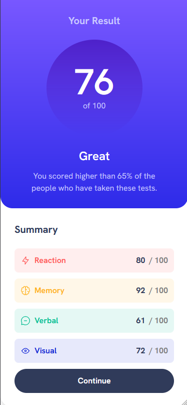

# Frontend Mentor - Results summary component solution

This is a solution to the [Results summary component challenge on Frontend Mentor](https://www.frontendmentor.io/challenges/results-summary-component-CE_K6s0maV). Frontend Mentor challenges help you improve your coding skills by building realistic projects. 

## Table of contents

- [Overview](#overview)
  - [The challenge](#the-challenge)
  - [Screenshot](#screenshot)
  - [Links](#links)
- [My process](#my-process)
  - [Built with](#built-with)
  - [What I learned](#what-i-learned)
  - [Continued development](#continued-development)
  - [Useful resources](#useful-resources)
- [Author](#author)

## Overview

### The challenge

Users should be able to:

- View the optimal layout for the interface depending on their device's screen size
- See hover and focus states for all interactive elements on the page
- **Bonus**: Use the local JSON data to dynamically populate the content

### Screenshot

Desktop Preview

Mobile Preview

### Links

- Solution URL: [Frontend Mentor Solution Page](https://www.frontendmentor.io/profile/Mnaqor66/solutions)
- Live Site URL: [live site URL](https://precious-blancmange-2effe8.netlify.app)

## My process

### Built with

- Semantic HTML5 markup
- Tailwind CSS
- Mobile-first workflow

### What I learned

From this challenge I learned to use Tailwind CSS, where tailwind CSS is something that I have just used after all this time I have continuously used Bootstrap, I learned it from the installation stage to configuration to how to use the classes in Tailwind CSS.

### Continued development

I haven't thought about the continuation of this project, if you have an idea for the continuation of this project you can contact me.

### Useful resources

- [Tailwind CSS Documentation](https://tailwindcss.com/docs/installation) - This official website of Tailwind CSS is very helpful for me in understanding the use of Tailwind CSS.

## Author

- Website - [Add your name here](https://www.your-site.com)
- Frontend Mentor - [@Mnaqor66](https://www.frontendmentor.io/profile/Mnaqor66)
- Twitter - [@NaufalAbqori3](https://x.com/NaufalAbqori3)